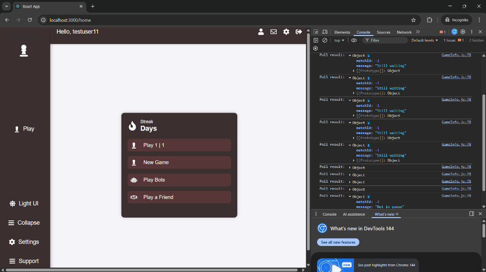

# Chess Clone Microservices

A real-time multiplayer chess application built with Spring Boot Microservices and React.



## Features

- **Microservices Architecture:**
  - `user-service`: Authentication & User Management (JWT, MySQL)
  - `match-service`: Game Logic, Matchmaking, WebSocket handling
  - `api-gateway`: Spring Cloud Gateway for routing
- **Real-time Multiplayer:** WebSocket-based move synchronization
- **Matchmaking:** Automated queue system to find opponents
- **Chess Logic:** Legal move validation, checkmate/stalemate detection
- **Time Controls:** Rapid (10m), Blitz (3m), Bullet (1m)

## Tech Stack

- **Backend:** Java, Spring Boot, Spring Cloud Gateway, WebSocket (STOMP), MySQL, Hibernate
- **Frontend:** React.js, chess.js (logic), react-chessboard (UI)
- **Infrastructure:** Docker, Docker Compose

## Getting Started

### Prerequisites
- Java 17+
- Node.js 16+
- Docker & Docker Compose
- Maven

### Running the Application

1. **Start Infrastructure (MySQL):**
   ```bash
   cd backend
   docker-compose up -d
   ```

2. **Build & Run Backend Services:**
   ```bash
   # Terminal 1 - User Service
   cd backend/user-service
   mvn spring-boot:run

   # Terminal 2 - Match Service
   cd backend/match-service
   mvn spring-boot:run

   # Terminal 3 - API Gateway
   cd backend/api-gateway
   mvn spring-boot:run
   ```

3. **run frontend:**
   ```bash
   cd frontend
   npm install
   npm start
   ```

4. Open `http://localhost:3000`

## Structure

- `/backend` - Spring Boot Microservices
- `/frontend` - React Application
- `/screenshots` - Project Images
